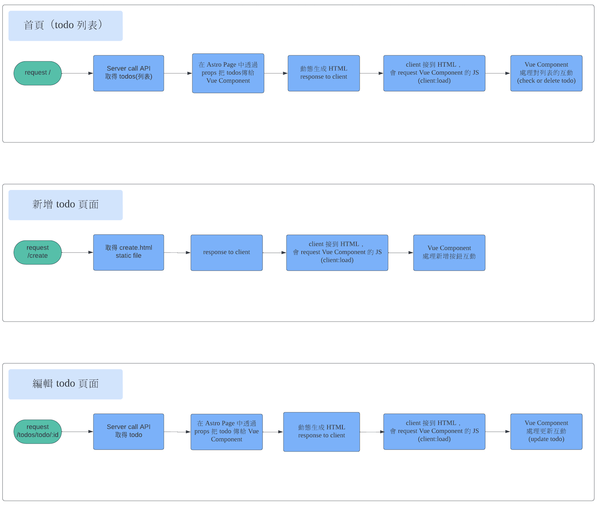

# Astro ToDoList

## 連結

網站：[http://3.139.77.220/](http://3.139.77.220/)

GitHub Repo：[https://github.com/RhinoLee/astro_todo_frontend](https://github.com/RhinoLee/astro_todo_frontend)

## 路由設定

| route           | desc              | render mode |
| --------------- | ----------------- | ----------- |
| /               | 首頁（todo 列表） | SSR         |
| /create         | 新增頁面          | SSG         |
| /todos/todo/:id | 編輯頁面          | SSR         |

### output: hybrid

預設所有路由都是 SSG，在頁面檔案加上 `export const prerender = false;` 讓對應的路由使用 SSR。

如果要在 server runtime 動態生成頁面，需要 adapter，這邊使用 @astrojs/node。

## Components - 主要元件

| name         | desc                               | mode                   |
| ------------ | ---------------------------------- | ---------------------- |
| Form.vue     | 編輯/新增表單元件                  | hydration(client:load) |
| TodoList.vue | todo 列表，有 checked, delete 功能 | hydration(client:load) |
| Header.vue   | Header                             | 100% HTML              |
| Footer.vue   | Footer                             | 100% HTML              |

### Flow

---
